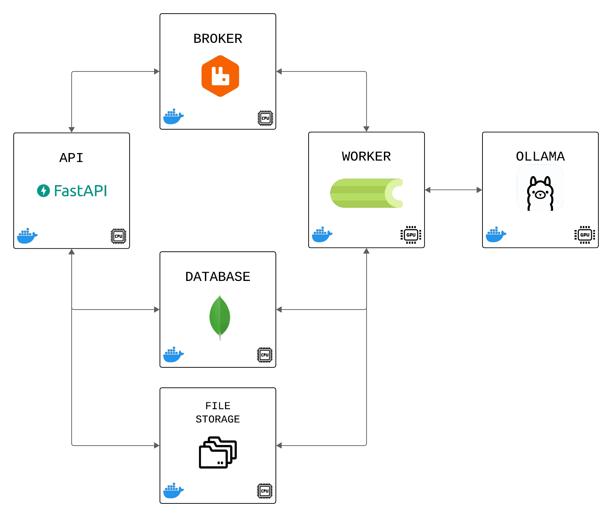

# Resume Analyzer

An intelligent Python-based application to automate résumé analysis using OCR and LLMs.
It accepts multiple files (PDFs or images), extracts text via OCR, generates summaries, and answers custom queries about candidate profiles — all integrated with auditable logging via MongoDB.

<p align="center">
  
</p>
<p align="center">
  <em>Architecture Diagram</em>
</p>

## Installation

> ⚠️ **System Requirements**
> To run this application properly, your machine must meet the following requirements:
>
> - A **GPU compatible with CUDA 12.2.0**
> - **Up-to-date GPU drivers** installed
> - **Docker configured to use the GPU**, following the [NVIDIA Container Toolkit installation guide](https://docs.nvidia.com/datacenter/cloud-native/container-toolkit/latest/install-guide.html)
>
> Please ensure GPU support is correctly set up before proceeding.

1. After cloning the repository, create an `.env` file based on the `.env.example` file and add any missing environment variables:

```bash
cp .env.example .env
```

2. Build and start the containers:

```bash
docker compose up -d --build
```

3. Verify the installation by accessing the development server. The API documentation is available at:
   [http://127.0.0.1:8000/docs/](http://127.0.0.1:8000/docs/)
